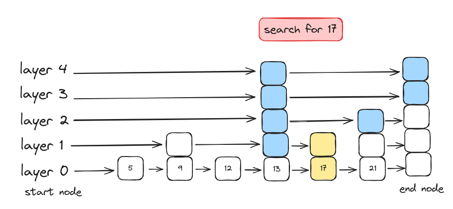
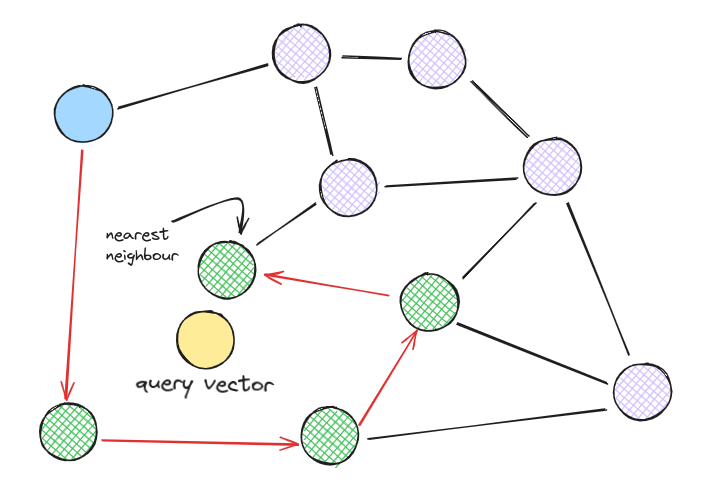
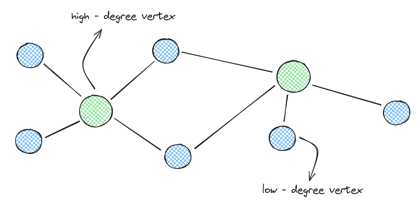
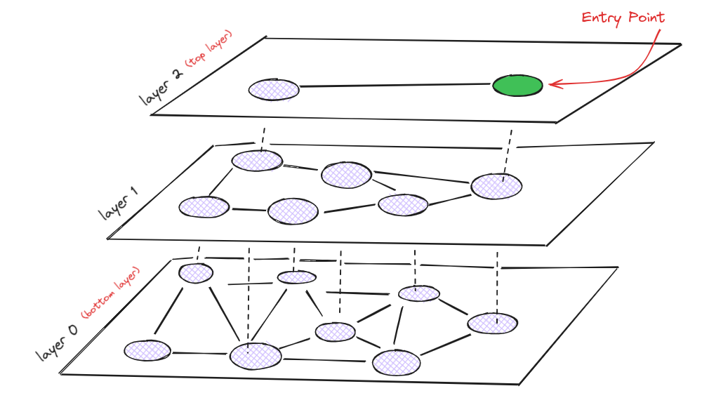
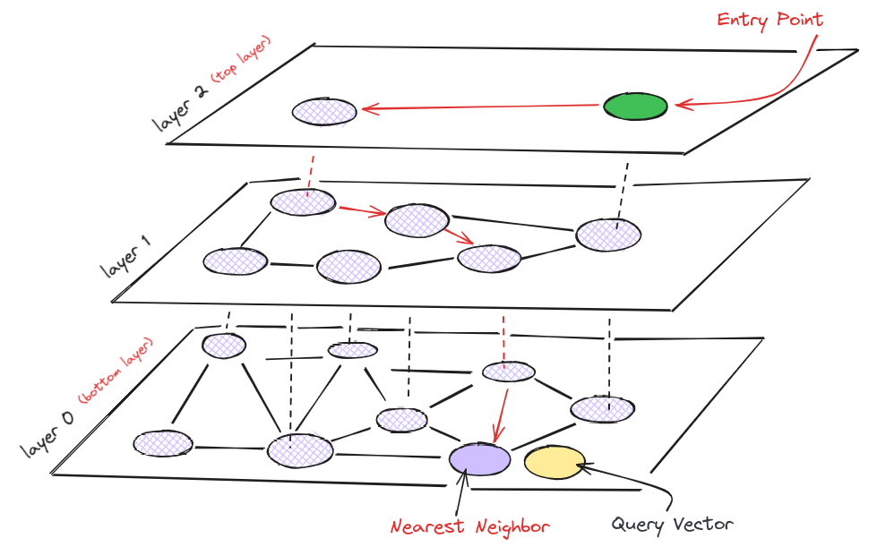

# HNSW: Vector search for High Dimensional datasets

Approximate Nearest Neighbor (ANN) search is a method for finding data points near a given point in a dataset, though not always the exact nearest one. HNSW is one of the most accurate and fastest Approximate Nearest Neighbour search algorithms, It’s beneficial in high-dimensional spaces where finding the same nearest neighbor would be too slow and costly. 

There are three main types of ANN search algorithms:

1. ***Tree-based search algorithms***: Use a tree structure to organize and store data points.
2. ***Hash-based search algorithms***: Use a hash table to store and manage data points.
3. ***Graph-based search algorithms***: Use a graph structure to store data points, which can be a bit complex. HNSW is a graph-based algorithm, that will be broken down into smaller parts to make it easier to understand how it works.

All graph-based search algorithms rely on the idea of a proximity graph, where the graph is built based on the proximity of data points, measured by their Euclidean distances. Jumping straight to HNSW might be complicated, so first, we'll explain two important algorithms that help understand HNSW: the ***Skip List*** and ***Navigable Small World (NSW) Graphs***, which are the predecessors of HNSW.

## *Skip List*
Skip List allows fast search capabilities similar to a sorted array but it will enable quick new element insertion, unlike sorted arrays.  In simple words, the [Skip list](https://brilliant.org/wiki/skip-lists/#:~:text=The%20skip%20list%20is%20a,elements%2C%20but%20no%20new%20elements.) is a multilayer linked list that stores a sorted list of elements where the top layer has links that skip over many nodes, while each lower layer skips over fewer nodes.

To search in the skip list, we start at the top layer with the longest skips and move right. If you find that the current node’s key is greater than the one you're looking for, move down to the next level and continue searching.

<figure markdown="span">
  
  <figcaption>Skip list, a Probabilistic data structure</figcaption>
</figure>

 
In the image above, the blue nodes represent the nodes that are compared to find our target value of 17, and the yellow node represents the found target.

HNSW also uses a similar layered structure, with high-degree nodes in the top layers for quick searches and low-degree nodes in the lower layers for more accurate searches.

## *Navigable Small World (NSW) Graphs*
The main concept behind NSW graphs is that if we take proximity graphs with long-range and short-range connections, search times can be very fast.

Here's how it works:

1. Each vertex/node connects to several others, forming a "friend list" containing nodes connected to it making search faster.
2. To search, we start at a set entry point and move to the closest neighbor.
3. We continue moving to the nearest neighbor in each friend list until we can't find a closer one.

This method makes finding a target much quicker.

<figure markdown="span">
  
  <figcaption>Search for the nearest neighbor of the query vector in the NSW graph</figcaption>
</figure>


 
Routing or Navigation through the graph happens in two steps:

1. ***Zoom-Out Phase***: We first move through vertices/nodes with fewer connections to cover a lot of ground quickly, this step makes it faster.
2. ***Zoom-In Phase***: Next, we move through vertices with more connections to get closer to our target.

We stop when no closer vertices are in the current vertices's friend list.

<figure markdown="span">
  
  <figcaption>Routing through NSW graph with high-degree and low-degree vertex</figcaption>
</figure>


 
## HNSW: Hierarchical Navigable Small Worlds
HNSW improved the NSW algorithm by adding a hierarchical structure using a skip list. Adding hierarchy to NSW forms a layer graph where at the top layer, we have the longest links, and at the bottom layer, we have the shortest.

<figure markdown="span">
  
  <figcaption>HNSW graph, the top layer with an entry point and the longest links, and as you go down each layer, the links get shorter</figcaption>
</figure>


 
During the search in HNSW, we

1. Start at the top layer with the longest links, these vertices usually have longer connections and spread across layers.
2. Move to the nearest higher-degree vertices in each layer until reaching a local minimum.
3. Switch to a lower layer and repeat the process.
4. Continue this until the local minimum in the bottom layer (layer 0) is found.

<figure markdown="span">
  
  <figcaption>Searching the nearest neighbor of the query vector in the HNSW graph</figcaption>
</figure>


 
## Putting it all together
We can combine the above concepts to understand how to build and query an HNSW index in LanceDB.

**Construct index**

```python
import lancedb
import numpy as np
uri = "/tmp/lancedb"
db = lancedb.connect(uri)

# Create 10,000 sample vectors
data = [{"vector": row, "item": f"item {i}"}
   for i, row in enumerate(np.random.random((10_000, 1536)).astype('float32'))]

# Add the vectors to a table
tbl = db.create_table("my_vectors", data=data)

# Create and train the HNSW index for a 1536-dimensional vector
# Make sure you have enough data in the table for an effective training step
tbl.create_index(index_type=IVF_HNSW_SQ)
```

**Query the index**
```python
# Search using a random 1536-dimensional embedding
tbl.search(np.random.random((1536))) \
    .limit(2) \
    .to_pandas()
```

You've now understood an HNSW index and how to use it in LanceDB. Next, check out [how to create and use an IVF-PQ index](https://blog.lancedb.com/benchmarking-lancedb-92b01032874a-2/), and [explore other types of ANN indexes](https://lancedb.github.io/lancedb/ann_indexes/) available in LanceDB.

## Conclusion
The article discussed the Hierarchical Navigable Small World (HNSW) graph, which is a popular method for quick and accurate ANN search in high-dimensional datasets. HNSW combines two techniques: Navigable Small World graphs and layered Skip lists. When using HNSW with LanceDB, you just need to specify `index_type` and use the `create_index` function.

## References
1. [Skip lists: a probabilistic alternative to balanced trees](https://15721.courses.cs.cmu.edu/spring2018/papers/08-oltpindexes1/pugh-skiplists-cacm1990.pdf) (1990) by William Pugh.
2. [Approximate nearest neighbor algorithm based on navigable small world graphs](https://publications.hse.ru/mirror/pubs/share/folder/x5p6h7thif/direct/128296059) (2014) by Y. Malkov et al.
3. [Efficient and robust approximate nearest neighbor search using Hierarchical Navigable Small World graphs](https://arxiv.org/abs/1603.09320)(2016) by Y. Malkov and D. Yashunin.
4. [Header-only C++/python library for fast approximate nearest neighbors](https://github.com/nmslib/hnswlib).