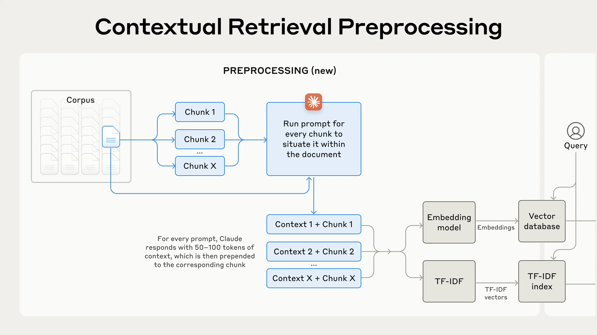

# Improve RAG with Contextual Retrieval
For chatbots to be effective in domains like legal advice or customer support, they require relevant background information. Retrieval-Augmented Generation (RAG) enhances responses by pulling information from knowledge bases and combining it with the user’s prompt, improving the model's output. However, traditional RAG often end up losing crucial context, leading to missing relevant information from the knowledge base.
Some might suggest that writing very specific and lengthy context prompts could solve the issue of retrieving relevant information from a knowledge base. But this approach only works for smaller knowledge bases. You'll need a more efficient and scalable solution as your knowledge base expands.

<a href="https://colab.research.google.com/github/lancedb/vectordb-recipes/blob/main/tutorials/RAG-with_MatryoshkaEmbed-Llamaindex/RAG_with_MatryoshkaEmbedding_and_Llamaindex.ipynb"></a>

## Contextual Retrieval
In traditional RAG, a basic chunking method creates vector embeddings for each chunk separately, and RAG systems use these embeddings to find chunks that match the query. However, this approach has a problem: it loses the context of the original document. 
In the past, several methods have been proposed to improve retrieval using context. These **include adding generic document summaries to chunks,  ***[Hypothetical Document Embedding (HyDE)](https://lancedb.github.io/lancedb/rag/advanced_techniques/hyde/)***, and summary-based indexing**.

**Contextual Embeddings** address this issue by incorporating relevant context and prepending it into each chunk before creating embeddings. This approach enhances the quality of each embedded chunk, leading to more accurate retrieval and improved overall performance. On average, across all the data sources we tested, Contextual Embeddings reduced the failure rate for retrieving the top 20 chunks by 35%.Contextual Retrieval Processing



To understand it better with domain-specific examples

In the case of  **Legal Documents**

***Scenario***: A user asks, "What was the outcome of the Johnson v. Smith case?"

***Relevant*** Chunk: "The court ruled in favor of Johnson, awarding damages of $50,000."

***Problem***: Without additional context, it’s unclear which Johnson and Smith are being referenced, or the date of the case, making it difficult to retrieve or apply the information.

***Solution***: Contextual Retrieval can enhance the chunk by including key identifiers, such as “In the 2021 case of Johnson v. Smith in the New York District Court, the court ruled in favor of Johnson, awarding damages of $50,000.” This added context helps ensure accurate retrieval and interpretation.

In the case of **Customer Support**

***Scenario***: A customer asks, "What is the return policy for electronics?"

***Relevant Chunk***: "Customers have 30 days to return items for a full refund."

***Problem***: Without knowing that this applies specifically to electronics and any conditions (like whether the item must be unopened), the information may be incomplete.

***Solution***: Contextual Retrieval can enhance the response by saying, "For electronics, customers have 30 days to return items in their original packaging for a full refund." This adds necessary context that clarifies the policy.

### Implementation

To implement Contextual Retrieval, we need to annotate thousands or even millions of chunks in a knowledge base by prepending context with them. We can do the same using Claude3 by creating a prompt that directs the model to provide concise, chunk-specific context by using the overall document's context to generate context for each chunk.<document> 
{{WHOLE_DOCUMENT}} 
</document> 
Here is the chunk we want to situate within the whole document 
<chunk> 
{{CHUNK_CONTENT}} 
</chunk> 
Please give a short succinct context to situate this chunk within the overall document to improve search retrieval of the chunk. Answer only with the succinct context and nothing else. 


The resulting contextual text, typically between 50-100 tokens, is added to the chunk as a context before embedding and indexing it.
Let's take an example to understand how to generate the contextual chunks, which asks the Claude3-Haiku LLM to provide a succinct context for the chunk within the document.
Following are the raw chunks utilized by Naive RAG:

```
The recent SEC filing provided insights into ACME Corp's performance for Q2 2023.
----------------------------------------------------------------------------
It highlighted a 3% revenue growth over the previous quarter.
----------------------------------------------------------------------------
The company, which had a revenue of $314 million in the prior quarter, showed steady progress.
----------------------------------------------------------------------------
They attributed this growth to strategic initiatives and operational efficiencies.
----------------------------------------------------------------------------
The report emphasized the company's resilience and ability to navigate market challenges, reflecting positively on their financial health and future prospects.
----------------------------------------------------------------------------
```

Now we'll augment these chunks, which include the context of the document provided by the LLM and the chunk.

```
The document provides an overview of ACME Corp's financial performance in Q2 2023 based on their recent SEC filing. The recent SEC filing provided insights into ACME Corp's performance for Q2 2023.
----------------------------------------------------------------------------------------------------
The document provides an overview of ACME Corp's financial performance in Q2 2023 based on the recent SEC filing. It highlighted a 3% revenue growth over the previous quarter.
----------------------------------------------------------------------------------------------------
The document provides an overview of ACME Corp's financial performance in Q2 2023. The company, which had a revenue of $314 million in the prior quarter, showed steady progress.
----------------------------------------------------------------------------------------------------
The document provides an overview of ACME Corp's financial performance for the second quarter of 2023 based on its recent SEC filing. They attributed this growth to strategic initiatives and operational efficiencies.
----------------------------------------------------------------------------------------------------
The document provides an overview of ACME Corp's financial performance in Q2 2023 based on their recent SEC filing. The report emphasized the company's resilience and ability to navigate market challenges, reflecting positively on their financial health and future prospects.
----------------------------------------------------------------------------------------------------
```

### Things to keep in mind
When implementing Contextual Retrieval, keep the following factors in mind:
1. Chunk Boundaries: How you split documents into chunks can affect retrieval performance. Pay attention to chunk size, boundaries, and overlap.
2. Embedding Model: While Contextual Retrieval improves performance across various models, some like Gemini and OpenAI may benefit more.
3. Custom Prompts: A generic prompt works well, but tailored prompts for your specific domain—such as including a glossary—can yield better results.
4. Number of Chunks: More chunks in the context window increase the chance of capturing relevant information, but too many can overwhelm the model. We found that using 20 chunks performed best, though it’s good to experiment based on your needs.

### Boost up Contextual retriever with Reranking
In the final step, we can boost performance by combining Contextual Retrieval with Reranking. In traditional RAG, vector search often retrieves many chunks from the knowledge base — of varying relevance.

In the context of search, Reranking means reordering the search results returned by a search algorithm based on some criteria. This can be useful when the initial ranking of the search results is not satisfactory or when the user has provided additional information that can be used to improve the ranking of the search results.

Steps for performing Reranking :
1. Perform initial retrieval to get the top chunks.
Pass these chunks, along with the user’s query, to the reranking model.
2. Score each chunk based on relevance, then select the top chunks (we used the top 20).
Input the top chunks into the model as context to generate the final result.
**LanceDB Reranking API**
LanceDB comes with some built-in rerankers. To use a reranker, you need to create an instance of the reranker and pass it to the ``rerank`` method of the query builder.

```
from lancedb.rerankers import ColbertReranker
colbert = ColbertReranker()

table.search("query").rerank(reranker=colbert) # reranker vector search
table.search("query", query_type="fts").rerank(reranker=colbert)
```

Learn more about [Improving (almost) any retriever with LanceDB hybrid search and Reranking](https://blog.lancedb.com/hybrid-search-and-reranking-report/).

## Conclusion
Using the combinations of techniques and steps described — proper chunking, embedding models, Contextual Retrieval, and reranking with top-K results across various datasets—here’s a summary of our findings:
1. Hybrid search with BM25 outperforms vector search alone.

2. OpenAI and Gemini are among the best embedding models.

3. Passing the top-20 to top-30 chunks to the model is more effective than using just the top-10 or top-5.

4. Adding context to chunks significantly improves retrieval accuracy and enables Contextual Retrieval.

5. [LanceDB Reranking API](https://lancedb.github.io/lancedb/reranking/) yields better results than not using it.